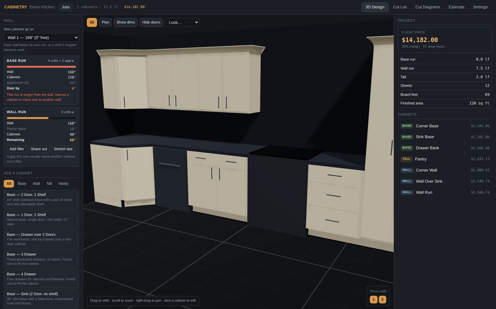
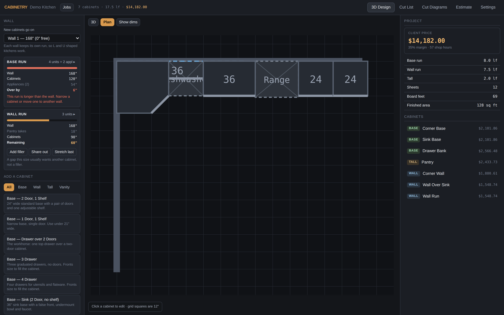
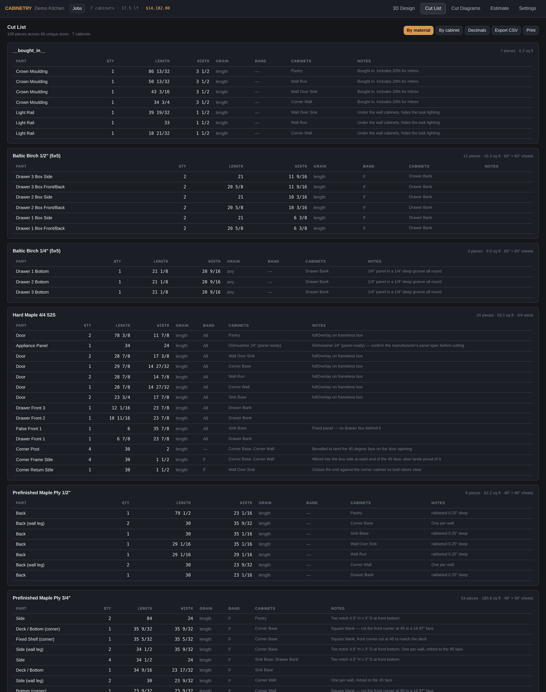
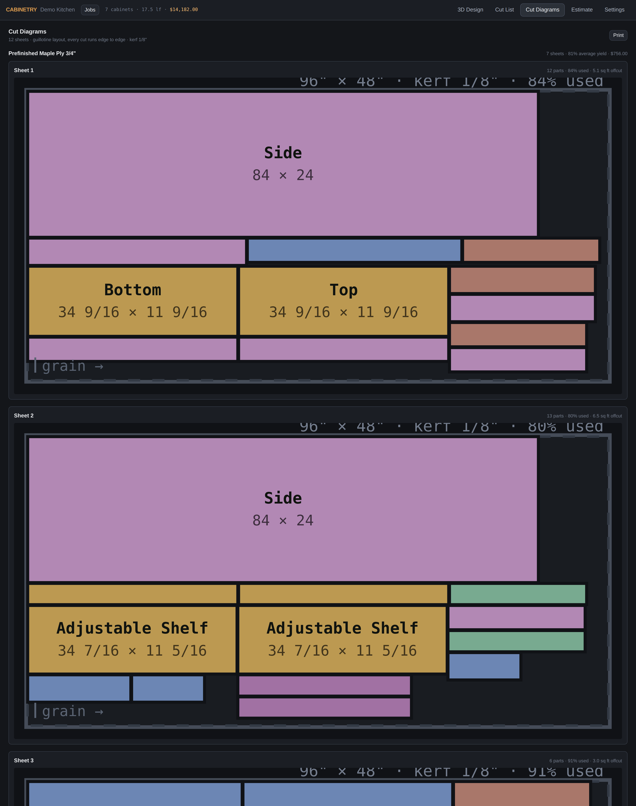
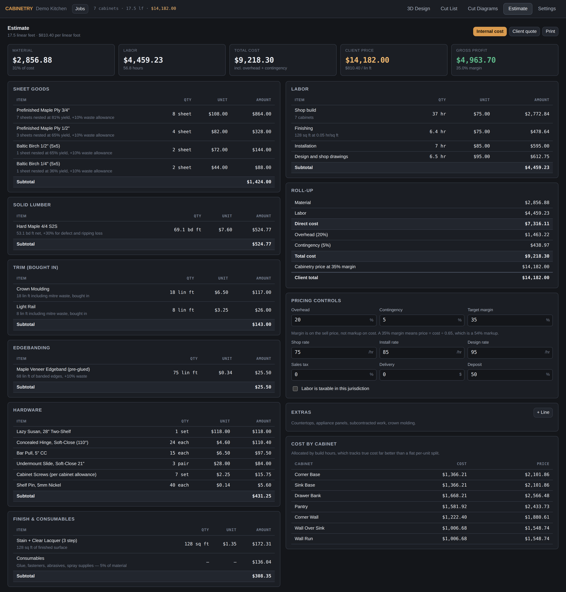

# Cabinetry

Design custom cabinetry, generate shop-ready cut lists and sheet layouts, and
price the job — all from one model. Change a cabinet and the cut list, the
nesting diagrams, and the estimate all move with it.

Runs entirely in your browser. Nothing is uploaded anywhere; your projects live
in local storage and export to a file when you want a backup.

## What it looks like

**3D Design.** Cabinets and appliances come off the library on the left, size and materials on the right. The panel tracks how the wall adds up as you go: wall length, what the corner takes, what the cabinets use, and what is left over. Orbit the 3D view or drag cabinets straight onto the plan.



**Plan view.** Drag cabinets and appliances into place. They snap to a quarter inch and sit flush against their neighbours, and each wall carries a dimension line with any leftover called out in red.



**Cut List.** Every part, grouped by material or by cabinet, with grain direction and which edges get banded. Exports to CSV and prints clean.



**Cut Diagrams.** Sheet layouts from a guillotine optimizer, so every cut runs edge to edge the way a panel saw actually works. Respects kerf, edge trim, and grain. Each sheet reports its own yield.



**Estimate.** Two views of the same numbers. Internal cost breaks out material, labor, overhead and margin, with cost allocated per cabinet by build hours rather than a flat per-unit split. Client quote is the printable version with the cost structure stripped out.



*Screenshots are the included `demo-kitchen.cabinetry.json` job, so you can open exactly this and click around.*

## Running it

```bash
npm install
```

```bash
npm run dev
```

Opens at http://localhost:5180.

To build a static copy you can open without a dev server:

```bash
npm run build
```

The result lands in `dist/`.

## Jobs

Every project is a job you can come back to. The **Jobs** button in the top bar
opens the library: save the open job, start a new one, copy an old one as a
starting point, or switch between them. Switching always saves what you have
open first.

Storage is per browser. A job saved in Chrome is not visible in another browser
or on another machine — use **Export** to write a `.json` file and **Import** to
open it elsewhere. `demo-kitchen.cabinetry.json` in this folder is a worked
example: a corner base, sink base with a false front, drawer bank, pantry,
corner wall cabinet, crown, and two appliances.

## The five tabs

**3D Design** — pick cabinets and appliances from the library on the left, size
them and set materials on the right. Orbit the 3D view, or switch to **Plan**
and drag cabinets and appliances straight onto the layout — they snap to a
quarter inch and go flush against their neighbours. Overlapping cabinets are
flagged before you cut anything.

**Cut List** — every part, grouped by material or by cabinet, with grain
direction and which edges get banded. Exports to CSV and prints clean.

**Cut Diagrams** — sheet layouts from a guillotine optimizer, so every cut runs
edge to edge the way a table saw or panel saw actually works. Respects your
kerf, your edge trim, and grain direction. Solid hardwood gets a board-foot buy
plus a rough-cut list instead, because it comes in random widths.

**Estimate** — two views of the same numbers. *Internal cost* breaks out
material, labor, overhead and margin. *Client quote* is the printable version
with your cost structure stripped out.

**Settings** — construction standards, prices, labor rates, room walls, and
project save/load.

## Before you quote a real job

The material and hardware prices that ship with this are realistic US
shop-buy figures, but **they are not your numbers**. Open
*Settings → Materials & Prices* and replace them with your supplier's, then
set your labor rates under *Settings → Labor & Rates*. Everything downstream
depends on those.

Two more worth checking on day one:

- **Sheet thickness.** Nominal 3/4" domestic plywood is really 23/32", and
  that difference propagates through every deck, shelf and drawer box. Measure
  your stock and correct it if your supplier runs different.
- **Margin vs markup.** The target margin is a margin *on the sell price*, not
  a markup on cost. 35% margin means price = cost ÷ 0.65, which is a 54%
  markup. Setting 35% expecting a markup will cost you money on every job.

## What the geometry assumes

The parts generator builds the common American shop cabinet:

- Sides run the full cabinet height. Base and tall cabinets get a toe notch cut
  in the front bottom corner rather than sitting on a separate ladder base.
- The deck and top are captured between the sides, so their length is the
  cabinet width less two side thicknesses.
- Base cabinets use front and rear stretchers; wall and tall cabinets get a
  full top panel.
- Backs are rabbeted into the sides by default.

All of that is adjustable under *Settings → Construction*, including back
style, top style, toe kick, shelf clearances, drawer slide clearance, kerf and
sheet trim.

The **toe kick face** is a real choice, not just a colour: cut it from the
carcass sheet (cheapest, fine when the kick is not really seen), from the door
material so an exposed kick matches the fronts, or painted out so the cabinets
read as floating. The setting drives the cut list and the cost, not only the
render — matching the doors moves the part onto your hardwood and the estimate
follows.

Note that a toe kick sits 3" back in its own shadow, so it always looks darker
on screen than the sample in your hand.

Face frame, frameless, and inset are all supported, set per project or
overridden per cabinet.

## Walls and runs

Cabinets belong to a **wall**, not to a single left-to-right line. Pick the wall
new cabinets go on at the top of the left panel; each wall keeps its own base
run and its own wall run, so L, U and galley kitchens all work. A cabinet's
position and rotation are derived from its wall, and the app works out which
way each wall faces by pointing the fronts at the middle of the room — so it
does not matter which direction you drew the wall in.

Resize a cabinet and everything after it in that run shifts to suit. Reorder
the list by dragging and the run re-flows to match. Drag a cabinet round a
corner in the plan view and it joins that wall's run; drag it clear of every
wall and it becomes free-standing, for an island.

### Closing the gap at the end of a run

The panel shows, continuously, how the selected wall adds up: wall length,
what the corner takes, what the cabinets use, and what is left. Three ways to
close a leftover, which is the same set of choices you have in the shop:

- **Add filler** — a scribe strip, the usual answer at a wall because it gives
  you something to scribe to. Fillers are real parts with a real cost and land
  on the cut list. Over about 4" you get a warning, because a wide filler
  reads as a mistake.
- **Share out** — spreads the leftover equally across every cabinet in the run.
  Right when the gap is small; the last unit absorbs the rounding so the run
  lands exactly on the wall rather than a sixteenth short.
- **Stretch last** — widens only the last cabinet.

A gap over about 6" usually wants another cabinet rather than any of these,
and the panel says so.

Plan view draws a dimension line along each wall showing the run length, with
any leftover called out in red. Toggle it with **Hide dims**.

Corner cabinets are square in plan, so a unit in the corner of one wall also
runs its full width back along the wall returning off it. That length is
subtracted from the adjoining run automatically — at whichever end the corner
falls, since a wall's run direction depends on which way it faces.

## Hiding walls

The numbered buttons at the bottom right of the 3D view hide a wall so you can
look into the room past it. Hiding a wall takes its cabinets and appliances
with it, and **All** brings everything back.

A cabinet standing on two walls — a corner — only disappears once **both** of
its walls are hidden, since it is still holding up the run on the wall you can
still see.

This is presentation only. Nothing hidden leaves the cut list or the estimate;
use *Exclude from estimate* on a cabinet for that.

## Presentation

*Settings → Appearance* changes how the 3D view looks without touching a
single number in the cut list or estimate. Background, wall, floor and
countertop colours are all editable, plus brightness and toggles for the grid,
the walls and the countertops — dropping the countertops is the quickest way
to show a client the boxes and drawer layout underneath.

Five presets cover most needs: **Shop Dark** for working, **Charcoal** for
softer contrast against pale timber, **Studio Light** and **Warm Room** for
showing a client, and **Blueprint** for drawings. There is a quick switcher in
the top-left of the 3D view so you can change the look mid-conversation. The
choice is saved with the job.

## Corners

Both kinds, set per cabinet under **Corner** in the editor.

**Diagonal** (lazy susan) sits square against both walls with a 45° face. The
door is sized from the geometry, not guessed: with the corner at the origin and
the neighbouring runs butting into its sides, the exposed face runs from
`(width, depth)` to `(depth, width)`, so it measures `(width − depth) × √2`. The
familiar 36" corner with 24" deep neighbours therefore carries a 17" door,
matching the catalogues. The cut list gives square blanks with a note to cut the
front corner at 45°, which is how the parts are actually made, plus bevelled
corner posts and a mitred toe kick.

**Blind** runs the box past the corner. Set how much is blind and which end runs
in; the reachable opening is the remainder, and doors and drawers are sized and
positioned against that rather than the full width. A filler panel closes the
dead space for the returning run to scribe to.

Corners bill their own hardware — a lazy susan or a blind-corner pull-out — and
carry extra build hours, since angled cuts and fitting genuinely take longer.

## Sinks

A sink belongs to its **cabinet**, not to the appliance list — it sits in the
countertop rather than standing on the floor, so it takes no run length and
never interferes with packing or the gap arithmetic. Set one under *Sink* in
the cabinet editor: undermount, top mount, or farmhouse.

The 3D view drops a basin in and stands a faucet behind it. An undermount or
top mount gets a hole cut in the counter; a **farmhouse is open at the front**,
so the counter stops either side of the bowl and its edge returns back toward
the wall rather than running across the apron.

The counter also carries over an under-counter appliance — a dishwasher or a
wine fridge — the same way it does over a cabinet.

A **farmhouse** bowl is a construction change, not just a look. Its apron owns
the top of the face, so the doors below run shorter and the cut list follows —
a 36" cabinet with a 10" apron gives 19⅞" doors instead of 23¾". The sink's own
apron is the exposed face, so the shop builds only the fillers either side of
it plus a pair of ledgers, because an apron bowl carries its filled weight on
the cabinet rather than the counter.

## Wall ovens

A tall cabinet can carry an oven pocket, set under *Wall Oven* in the editor:
single or double stacked, with the rough opening size and its height above the
floor. The opening splits the face — **drawers below, doors above** — and both
resize themselves from it. Move the opening and everything either side follows.

The usual layout for an 84" cabinet:

| | Single | Double |
|---|---|---|
| Opening height | 28½" | 50" |
| Bottom of opening | 30" | 24" |
| Below | drawers to 30" | drawer to 24" |
| Above | ~25" door | ~10" door |

The oven floor sits near counter height on a single so you are not stooping to
it. The pocket can be left empty to show the opening, or draw the appliance.
The cut list gains a deck, a header and a pair of bearers, because a wall oven
is heavy and wants fastening into both sides.

> Rough openings vary by model. Check the spec sheet before cutting — an
> opening a quarter inch tight is a rebuild.

## Trim and appliances

**Crown** and **light rail** are switched on under *Settings → Trim*. Crown runs
across wall and tall cabinets by default and any cabinet can opt out. The run
length covers the front plus any end not buried against a neighbour of the same
height, with a mitre waste allowance on top.

Crown is drawn through a moulding profile rather than as a square tube, and it
laps an inch down over the cabinet top so there is no seam at the edge. A
crowned cabinet also runs a wider top rail — 3" by default, set under
*Settings → Construction* — because a 1-1/2" rail leaves almost nothing to
fasten into once that lap is taken off. Corner cabinets get crown across their
45° face like anything else. Choose whether you mill it in the
shop — in which case it consumes board feet in the lumber takeoff — or buy it in
by the linear foot, where it is priced separately and never touches the sheet or
board-foot numbers.

**Appliances** drop in from the left panel with nominal sizes for ranges,
refrigerators, dishwashers, ovens, hoods and microwaves. Panel-ready units add
appliance panels to the cut list and the estimate.

A floor-standing appliance is a **member of its run**, not an obstacle sitting
at a fixed spot. A range between two cabinets is ordered in that run like a
cabinet: widen the cabinet before it and the range shifts along, taking
everything after it with it. It carries its own width dimension in the 3D view
for the same reason. Add one with a base cabinet selected and it lands in the
next bay along, never inside the cabinet.

A hood or over-range microwave is the exception — it is positioned against the
cabinet it hangs under rather than packed into the run.

> Appliance sizes here are nominal. Always confirm against the actual model's
> spec sheet before cutting an opening — the panel size in particular is taken
> from the appliance body, and manufacturers specify their own.

## Entering dimensions

Dimension fields read the way a tape measure does. All of these work:

```
24        24.5      24 1/2      24-1/2      1/2
34 1/2"   2'        2' 6        2' 6 1/4"   620mm
```

Whatever you type is echoed back as a fraction so you can see what was
understood. Part sizes are snapped to the nearest 1/32", since that is the
finest division anyone actually cuts to.

## Project structure

```
src/
  domain/            all the math, no UI
    units.ts           fractional-inch parsing and formatting
    types.ts           the data model
    materials.ts       default material, hardware and finish catalog
    defaults.ts        construction standards and cabinet presets
    partsGenerator.ts  cabinet -> parts, and the door/drawer face layout
    geometry.ts        cabinet -> 3D solids, shared with the elevations
    nesting.ts         guillotine sheet optimizer and lumber planning
    estimate.ts        cost roll-up and pricing
    __tests__/
  components/        views and controls
    __tests__/
  store/             project state and local persistence
```

The domain layer is pure TypeScript with no React in it, so the math is
testable on its own and the 3D view and cut list are guaranteed to come from
the same calculation.

## Tests

```bash
npm test
```

539 tests, split between the domain layer and the views.

**326 domain tests** cover dimension parsing round-trips, door and drawer face
layout across all three construction styles, corner geometry and clearance,
wall placement and multi-run layout, part generation, crown run lengths,
appliance panels, nesting correctness (no overlaps, nothing off-sheet, grain
respected), collision detection in all three axes, estimate sanity including
the margin calculation, and project migration — a job saved by an older build
must still open.

**213 component tests** cover all fifteen components. They drive the control a
user would touch and read the store back, so a field wired to a neighbouring
property cannot pass. The drawings are checked by their geometry rather than
their captions: the cut diagrams are read off the rendered SVG to confirm no
two parts overlap, nothing lands off the sheet, and the yield on the card
matches the area the rectangles actually cover; the 3D dimensions are read off
the scene graph the same way. The cut list is held to the sizes the domain
produced and its CSV to nine columns a spreadsheet can open. The estimate is
checked against the same figures, and the client quote is checked for what it
must never show — no cost, no margin, no overhead.

Scene3D is the exception, and is covered at mount level only: it owns its own
canvas, and without WebGL react-three-fiber never builds a renderer, so what
it draws cannot be inspected from a test. What is covered there is that the
view survives every shape a project can take.
